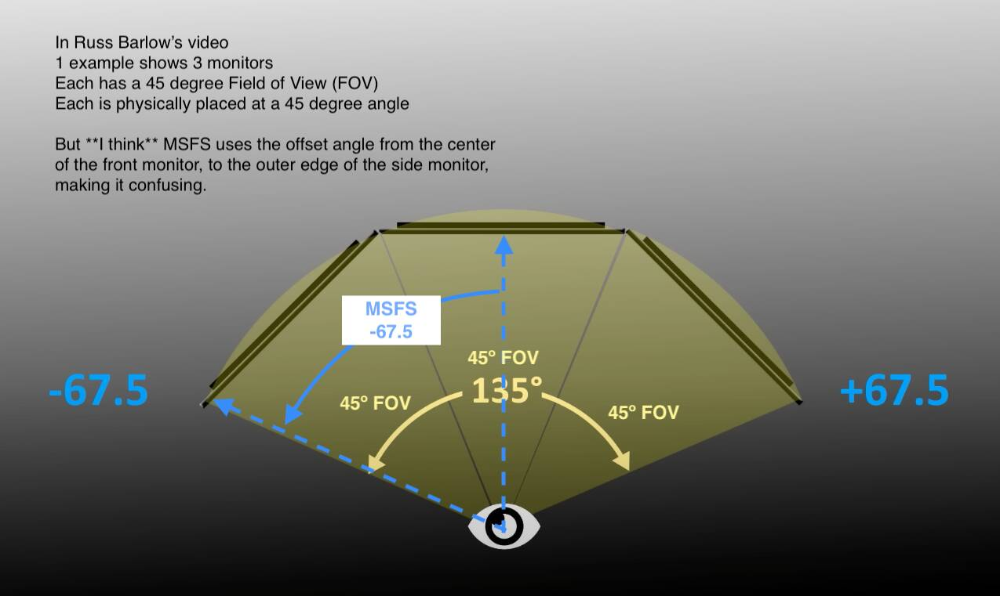

[⬅️ Volver al Inicio](README.md)

# 🖥️ Sistema Visual: Monitores de Alta Frecuencia

El monitor en SimRacing no es solo una pantalla; es la ventana de referencia para la velocidad. Un retraso de milisegundos en la imagen provoca que el piloto frene tarde.

## 1. Tecnologías de Panel (La Física del Píxel)

| Tecnología | Estructura del Cristal | Ventaja en SimRacing | Desventaja |
| :--- | :--- | :--- | :--- |
| **IPS (In-Plane Switching)** | Cristales paralelos al plano. | Mejores ángulos de visión (clave para monitores triples). | Contraste pobre ("Glow"). |
| **VA (Vertical Alignment)** | Cristales perpendiculares. | Alto contraste. Muy usado en pantallas curvas (inmersión). | **Black Smearing** (estelas en zonas oscuras). |
| **OLED (Organic LED)** | Emisión de luz propia por píxel. | **Tiempo de respuesta instantáneo (<0.1ms)**. | Riesgo de quemado (Burn-in) con HUDs fijos. |

## 2. Ancho de Banda y Conectividad

Para mover resoluciones altas a muchos FPS, necesitamos un "tubo" de datos muy grande.

* **DisplayPort 1.4:** Soporta hasta **32.4 Gbps**. Es el estándar para PC (permite G-Sync).
* **HDMI 2.1:** Soporta hasta **48 Gbps**. Necesario para pantallas 4K a 120Hz+ sin compresión.

> **Cálculo de Ancho de Banda:** > Una pantalla "Super Ultrawide" (5120x1440) a 240Hz requiere mover:  
> $5120 \times 1440 \times 240 \text{ Hz} \times 24 \text{ bits/px} \approx 42.5 \text{ Gbit/s}$  
> *Conclusión:* Se requiere compresión (DSC) o cables de fibra óptica certificados.

## 3. Sincronización (Handshake GPU-Monitor)
Para evitar el *tearing* (corte de imagen), el monitor sincroniza sus Hz con los FPS de la GPU usando **VRR (Variable Refresh Rate)**.
* **G-SYNC (Nvidia):** Usa un chip de hardware propietario en el monitor.
* **FreeSync (AMD):** Estándar abierto sobre DisplayPort Adaptive-Sync.

## 4. Matemáticas: El FOV (Field of View)
El realismo depende de configurar el ángulo de visión correcto según la distancia del usuario.

> *Figura 2: Esquema de ángulos necesarios para calcular el FOV horizontal en base a la distancia del ojo a la pantalla.*

$$\text{vFOV} = 2 \cdot \arctan\left(\frac{\text{Altura Pantalla}}{2 \cdot \text{Distancia Ojos}}\right)$$

*Un FOV incorrecto altera la percepción de la velocidad.*
