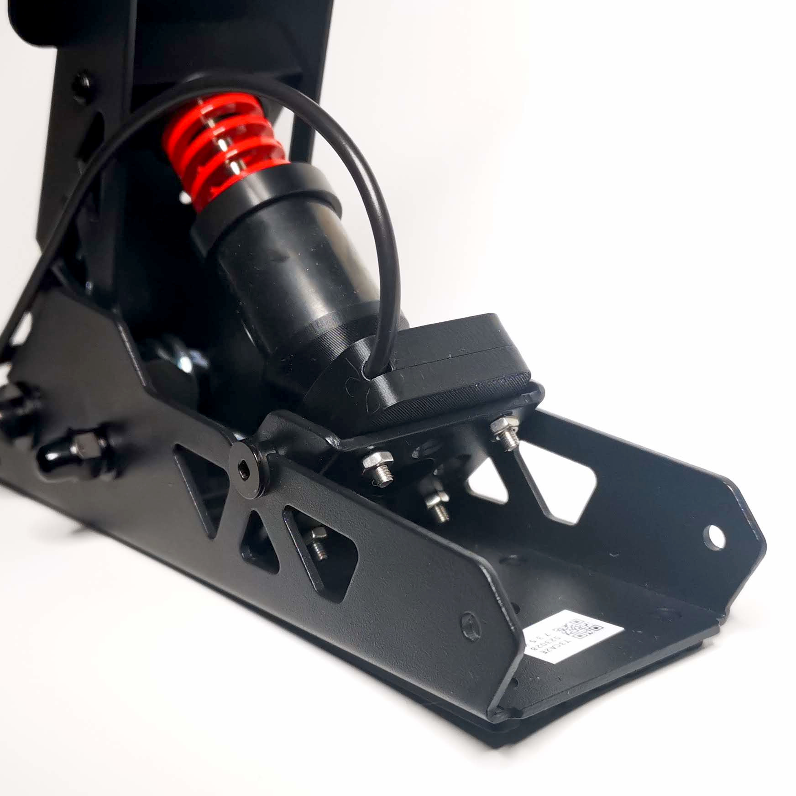

[⬅️ Volver al Inicio](README.md)

# 🏎️ Sistema de Control: Volantes y Pedales

El conjunto volante-pedales es un sistema mixto de **Entrada (Input)** y **Salida (Output)** háptica.

## 1. El Volante: Ingeniería del Force Feedback (FFB)
El motor no solo vibra; recibe datos de telemetría (suspensión, agarre de neumáticos) y genera una fuerza contraria (Torque) medida en **Newton-metro (Nm)**.

### Tipos de Transmisión

> *Figura 3: Izquierda: Direct Drive (el eje del motor es la columna de dirección). Derecha: Sistema de correas (pérdida de fuerza por fricción).*

1.  **Engranajes (Gear Driven):** Ruidoso y con holgura mecánica (*deadzone*).
2.  **Correas (Belt Driven):** Suave, pero la goma absorbe parte de las micro-vibraciones del asfalto.
3.  **Direct Drive (DD):** El volante está montado directamente sobre el eje del motor.
    * **Ventaja:** Sin intermediarios. Respuesta 1:1.
    * **Slew Rate:** Velocidad de cambio de fuerza casi instantánea.

### Sensores de Posición (Encoder)
¿Cómo sabe el PC cuánto hemos girado?
* **Potenciómetro:** Resistencia física variable por contacto (se desgasta y ensucia).
* **Sensor Hall (Magnético):** Mide cambios en el campo magnético sin contacto físico. **Vida útil infinita** y mayor resolución (12-16 bits).

## 2. Los Pedales: Célula de Carga vs Potenciómetro
La diferencia fundamental es física:

* **Pedales Básicos (Potenciómetro):** Miden **distancia**. El PC frena al 100% si el pedal recorre el 100% del camino.
* **Pedales Profesionales (Load Cell):** Miden **presión (Kg)**. Usan una *galga extensiométrica* que varía su resistencia al deformarse el metal.
    * *Realismo:* Puedes tener un pedal duro como una piedra; frenará más cuanto más fuerte pises, imitando un circuito hidráulico real.

> *Figura 4: Detalle de una Célula de Carga (Load Cell). La deformación del metal modifica la resistencia eléctrica, midiendo la presión exacta en Kg.*

## 3. Resolución Digital
La precisión se mide en bits.
* **8-bit:** 256 pasos de lectura (movimiento escalonado).
* **16-bit:** 65.536 pasos de lectura (movimiento fluido y quirúrgico).
